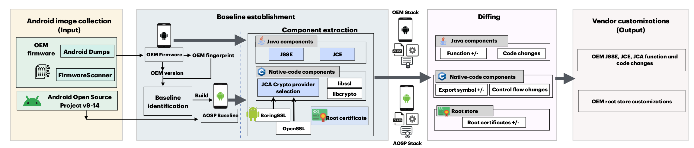

# Android TLS/SSL Stack Customization Extraction Pipeline

The goal of our pipeline is to extract vendor customizations made to the Android TLS/SSL stack, focusing on components such as JSSE, JCE, JCA (including Conscrypt, OkHttp, Bouncy Castle, BoringSSL), and the Android root store.

## Prerequisites

Ensure your machine meets the following requirements:
- **Disk Space**: At least 400 GB of free disk space (250 GB to check out + 150 GB to build Android images).
- **Software Packages**: Install the required packages from the [Android Open Source Project](https://source.android.com/docs/setup/start/requirements#install-packages) and these additional Python libraries:
  - pandas
  - numpy
  - ssdeep
  - colorama
  - pyOpenSSL

## Setting Up Your Environment

1. **Check Disk Space**: Ensure your machine has sufficient disk space as described above.
2. **Install Necessary Packages**: Refer to the link above and make sure to install the additional Python packages listed.

## Running the Pipeline

1. **Download OEM Firmware Images**:
   - Navigate to the `firmware_images/` directory.
   - Clone the repositories listed in `sample_oem.txt`.

2. **Prepare AOSP Images**:
   - We provide 5 baseline AOSP images for major Android releases in the `AOSP_BUILDS/` folder. If your target Android image is built on a different AOSP baseline, the pipeline will build it for you (This might take a few hours).

3. **Execute the Pipeline**:
   - Run the `main.py` file and follow the on-screen prompts.
   - Establish the baseline and proceed with the diffing process.

4. **Review Results**:
   - All results will be stored in the `diffing_results/` folder under the name of your input folder.